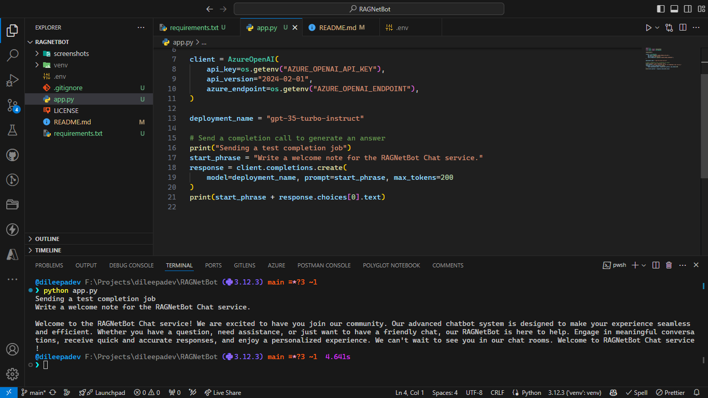

# RAGNetBot

An AI-powered chat assistant designed to provide contextually relevant responses. It delivers accurate and informative answers tailored to user queries.

Tech: Python, Azure OpenAI Service, LLM, LangChain, RAG, Pinecone, OpenAI API, and more.

## Status

🔴 **Project In-Progress (Under Development)**

This project is currently in the development phase. Features and documentation may change as we work towards the initial release. Stay tuned for updates!

📸 Screenshots:

[Open Screenshot](./screenshots/init.png)
